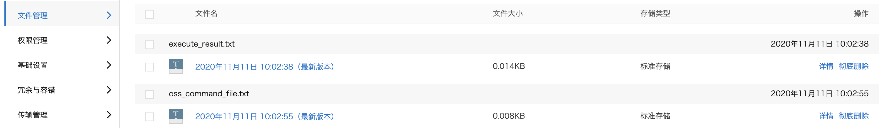
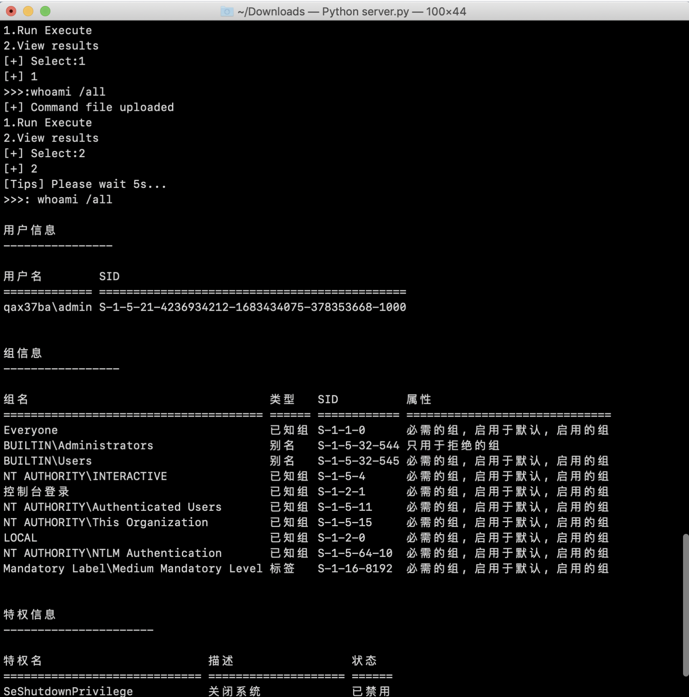
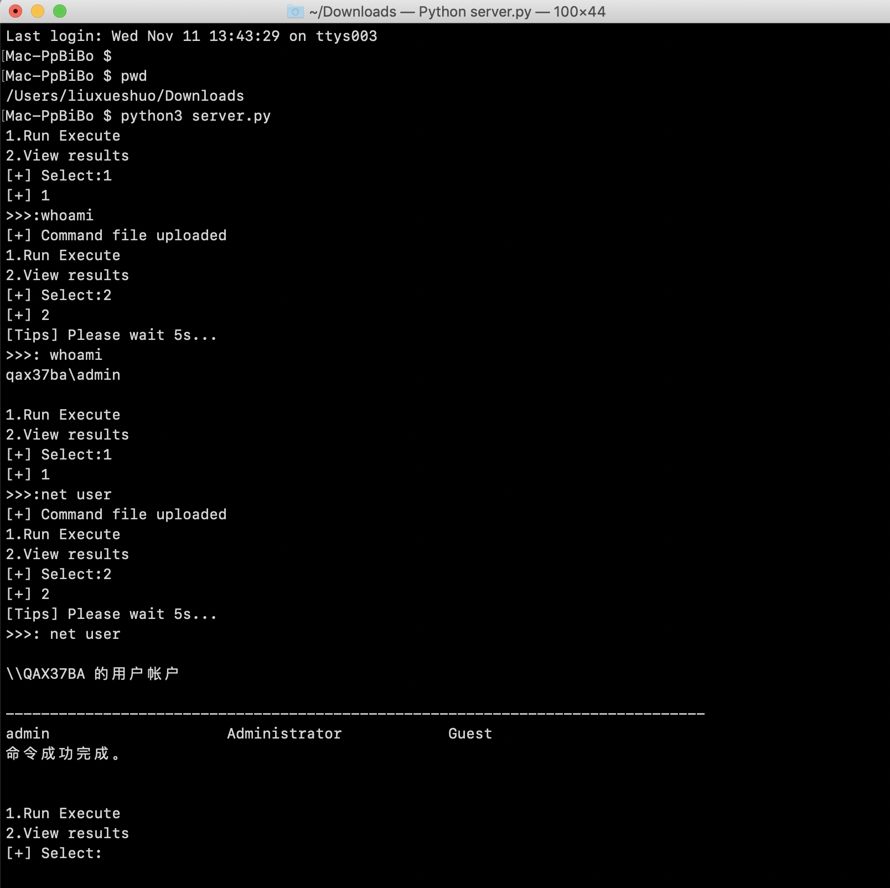

## C2-of-aliyun-OSS

基于阿里云 OSS 通信的 C2（Demo）

在一次项目中客户主机不出网并且设置了安全策略，允许访问部分大厂域名，所以写了个利用阿里云OSS来做为中转的 DEMO。

## 使用方法

1. 购买阿里云 OSS 对象存储。

2. 上传 execute_result.txt  oss_command_file.txt 两个文件到阿里云OSS。

3. 替换两个文件代码中的ossurl、BucketName、AccessKeyId、AccessKeySecret 参数内容。
4. 被控机器运行 client.py。
5. 攻击机运行 server.py 来执行远程命令并下发到被控机器。

Tips: 编译请使用python3的pyinstaller , python2 的pyinstaller 存在报错。

## 日志

时间：20201111

待添加功能文件下载。

参考：http://www.secbook.info/index.php/archives/463.html